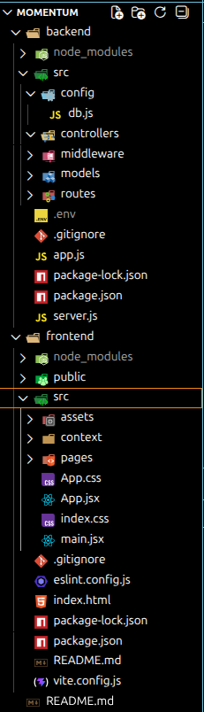

# Architecture Decision Record (ADR)

## Project Overview

This project is a small full-stack application built to track and manage work sessions.  
The goal of the project is to demonstrate core full-stack development skills including:

- Building a frontend with React
- Creating REST APIs with Node.js and Express
- Persisting data using MongoDB
- Structuring a full-stack project with clear separation of concerns

The project is intentionally kept simple and focuses on delivering a functional **Minimum Viable Product (MVP)** while leaving room for future improvements.

---

# Tech Stack

| Layer | Technology |
|------|-------------|
| Frontend | React |
| Backend | Node.js + Express |
| Database | MongoDB |
| ODM | Mongoose |

---

# Architecture Decisions

## Why React for the Frontend?

React was chosen for the frontend due to its **component-based architecture**, which makes it easier to build reusable and maintainable UI components.

Additional reasons include:

- Fast development setup
- Efficient state management for interactive interfaces
- Strong ecosystem and community support

Since I was already familiar with React, it allowed me to focus more on implementing features rather than spending time learning a new frontend framework.

---

## Why Node.js + Express for the Backend?

Node.js was chosen so the entire stack could use **JavaScript**, which simplifies development and context switching between frontend and backend.

Express was used because it provides:

- A lightweight framework for building REST APIs
- Minimal setup with flexible routing
- Clear and maintainable server structure

Having prior experience with Node.js and Express also helped speed up the development process.

---

## Why MongoDB + Mongoose?

MongoDB was selected as the database because of its **document-oriented NoSQL model**, which works well for flexible data structures.

Benefits include:

- Easy integration with JavaScript applications
- Flexible schema design
- Good fit for rapid development and prototyping

Mongoose is used as an **Object Data Modeling (ODM) library** to simplify interactions with MongoDB. It provides:

- Schema definitions for documents
- Data validation
- Cleaner query APIs

This helps maintain structure while still leveraging MongoDB’s flexibility.

---

# Folder Structure

The project follows a simple separation between frontend and backend components to keep the codebase organized and maintainable.

---

# MVP Scope

The current MVP focuses on delivering the core functionality of the application.

### User Features

- User can **register and log in**
- User can **create work sessions** from the add session page
- User can **view sessions in a table format**

The goal of the MVP is to demonstrate the full data flow:
